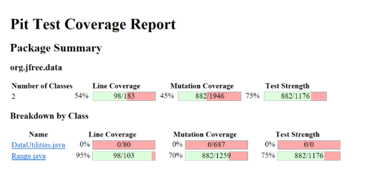

**SENG 438 - Software Testing, Reliability, and Quality**

**Lab. Report \#4 – Mutation Testing and Web app testing**


| Group: 8      |
|-----------------|
| Danny Duong 30120124                  |   
| Kevin Johnson 30124217                 |   
| Kaito Sugimura 30093204                |   
| Joshua Walters 30119430                |   

# Introduction

In this lab we apply mutation testing in part one and GUI testing in part two.

In part one, we inject mutation faults in a Java code-base using a mutation testing tool and interpret the reported mutation scores, using the knowledge to design new test cases and improve the quality of the test suite. In part two, we use record and replay, the most common GUi test automation method. We do this using Selenium and compare it to alternative tools.

# Analysis of 10 Mutants of the Range class

1. `1. replaced double return with 0.0d for org/jfree/data/Range::getLowerBound → KILLED` was killed by the original test suite. This was for `getLowerBound()` and was killed by a test that asserted that the return value was not 0.0d.
2. `4. Incremented (a++) double field lower → KILLED` was killed by the original test suite. This was for `getLowerBound()` and was killed by a test that asserted that the return value was equal to the correct lower field value.
3. `1. Replaced double subtraction with addition → KILLED` was for `getLength()` and was killed by a test that asserted on the basis that `getLength()` should use subtraction, not addition.
4. `27. Replaced double addition with modulus → SURVIVED` was a mutant for `getCentralValue()` that survived because there were no tests that distinguished between double addition and modulus.
5. `1.  changed conditional boundary → SURVIVED` was for `intersects(double b0, double b1)` and survived because the tests did not thoroughly test values on the boundaries of the conditionals.
6. `8. greater than to greater or equal → SURVIVED` was for `intersects(double b0, double b1)` and survived because the tests did not exercise the case where b1 and this.lower were equal.
7. `1.  replaced boolean return with false for org/jfree/data/Range::intersects → KILLED` was for `intersects(Range range)` and was killed by a test that expected this method to return true.
8. `3. removed call to org/jfree/data/Range::getLowerBound → KILLED` was for `intersects(Range range)` and was killed by 
9. `1. Negated double local variable number 1 → KILLED` was for `constrain(double value)` and was killed by a test that depended on the local variable staying the same.
10. `1. negated conditional → KILLED` was for `combine(Range range1, range range2)` and was killed by a test that depended on an equality condition being true/false through normal behavior.

# Report all the statistics and the mutation score for each test  +class

DataUtitlities.java before changes


DataUtilities.java after changes 


As shown in the two images above, utilizing the PIT mutations, we were able to get our Line Coverage and Mutation coverage from 91% to 99% and 83% to 90% respectively. 

Many of the mutations left were equivalent mutations. As our original code started off with a high mutation coverage, there were not many tests we could add. However, some notable test changes were made from inspecting the surviving mutations. An example of this was when the mutation substituted 1 for 0 in the initial state of a for loop of the equal function. This meant that the first element of the array was not being checked. This gave us an opportunity to include a test that checks for array inputs where only the first element differs. 
An example of an equivalent mutation that occurred often was decrementing or incrementing a value on the right side of an assignment . For example ```int a = func(b)``` was mutated to ```int a = func(b)++```. In this example, the value received from the func function is being incremented after the assignment. This means that a will be defined the same value regardless. Furthermore, since the value returned by func is scrapped after this line, the incrementation or decrementation has virtually no effect. 

Another common problem which necessarily is not an equivalent mutation, but caused a similar effect was changing the return value of a boolean returned function. That is, for example, if a function has the line ```return true``` at the end of its function, the mutation would change it to ```return -1```. This is not exactly an equivalent mutation since the underlying logic changes, however, the reason why we say it causes a similar effect is because it is something that is impossible to accommodate in the tests. What we mean by this is, ```return -1``` causes a syntax error. In java when a return value is declared boolean, it can only return true or false (1 or 0) but not -1. This will cause an error in the program, however, the mutation software (at least the PIT program) will not detect this as a KILLED mutation. Since the value is being directly changed at the end of the program, it is impossible to accommodate our tests for this mutation. Thus, the mutation itself should be considered invalid and changed. However, this leads to my next point. 

One thing we have noticed by inspecting the mutation changes using PIT is that it is not perfect. What we mean is that, many mutations are duplicated, which were more bothersome when they were also equivalent mutations. Some descriptions were also vague and hard to understand where the mutation occurred. Another problem was not being able to manually delete, change, mark down any of the equivalent mutations. This meant that we had to manually record down on paper to segregate the equivalent and non equivalent mutations.

However, in the end we are happy with the percentage of mutation coverage we got up to, that is, 90%. This percentage is accounting for all the equivalent mutations as well, which means that our real mutation coverage would be much higher, close to 100%!

Range.java before changes.



Range.java after changes.


As shown above we were able to improve our testing of the range class with line coverage going up from 95% to 100% and mutation coverage going up from 70% to 80%.

To improve the mutant testing coverage steps we planned to avoid unrecoverable mutants such as equivalent mutants, and stillborn mutants. Equivalent mutants always produce the correct test result regardless of what parameters are passed to them so will never be killed, and stillborn mutants are killed by compiler so will come back as unkilled in mutation testing as mutants that cause errors are not marked as killed. After taking into account these impossible to kill cases we went through the Range class to kill everything we could.

One common area that lacked mutant coverage was the changing of boundaries in conditionals throughout the class. For example changing the statement if(x<y) to if(x<=y). To account for this we implemented tests that had input on the boundaries to kill these mutants. One tricky case we ran into was that of the intersects method where the statement if(b0<= this.lower) having its boundary changed was difficult to kill. We discovered that this was due to the fact that in most cases of b0 being on the boundary and equal to this.lower the next conditional  in the function would still return the correct result. Resulting in  a past test and an unkilled mutant. Luckily we found the case (1,1) and (1,3) as input ranges covered this case and killed the mutant.

The final way we achieved this significant increase in mutant coverage was through testing of uncovered methods. We lacked coverage of the has method and implementing tests in this area significantly increased our mutant coverage with many more being killed.


# Analysis drawn on the effectiveness of each of the test classes

From the mutation scores reported, we can conclude that our DataUtilities test classes are comprehensive. A mutation coverage of 89% means that it killed most mutants generated by PIT and would therefore be effective at revealing any similar faults introduced by coding mistakes.

However, our mutation coverage for Range is only 70%, which indicates that our Range test classes are not as effective at killing mutants. 

After the improvements to the test cases the mutation coverage of DataUtilities was improved to 90% while Range was significantly better at 80% putting both our test suites with high coverage of mutants.

# A discussion on the effect of equivalent mutants on mutation score accuracy

Equivalent mutants are mutations that are syntactically different but are not functionally different. This basically means that even if the code looks different, when executed, it will produce the exact same results as the original. Thus, equivalent mutants should be avoided in the calculation of the mutation score because they don’t represent actual faults in the code. Including equivalent mutants in the calculation of the mutation score would artificially (falsely) inflate the number of mutants, which in turn, reduces the effectiveness of the metric as a measure of the quality of the test suite.

Equivalent mutants can be quite bothersome as they must be manually checked and removed. This involves manually inspecting the code for equivalency and removing them from the list. This process however, is not 100% accurate as it depends on the testers knowledge and intuition on equivalency. Therefore, equivalent mutants can be a complex problem that require the testers skill and correct intuition to deal with them.

We could potentially automatically detect equivalent mutants affecting for loops, where the condition checks if i (or a similar counter variable) is < or > a threshold, and in the update i is incremented or decremented towards this threshold. Here, we would know that mutants changing < or > to != are equivalent mutants since this would not affect the for loop in any way. This has the advantage of being a relatively simple way to remove equivalent mutants, but has the disadvantage of only applying to a specific pattern of for loops with counter variables incrementing/decrementing towards a threshold. It works on the assumption that these loops exist in the codebase to do any meaningful work of removing equivalent mutants.

# A discussion of what could have been done to improve the mutation score of the test suites

There are a number of ways that we could have further improved the mutation score of our test suites.

Some of the mutants that survived were conditional boundary mutants, which replace the operators <, <=, >, and >=. We could create tests with input values that will make the operands equal, thereby differentiating the behavior of < and <=, or > and =. These tests should kill these mutants and increase our mutation score.

Another type of mutant that survived were incrementing mutants, which incremented and decremented various variables. We could create tests where the values being compared are very close together, such that incrementing or decrementing one of the values would affect the branch decision. Adding these tests would kill these mutants and further increase our mutation score.

There are other mutant types that survived our mutation testing, and we can similarly increase our mutation score by adding tests that detect the changes made by these mutants.

# Why do we need mutation testing? Advantages and disadvantages of mutation testing

We need mutation testing because it can be ambiguous whether our tests are passing because we’ve detected all faults or because our test cases are insufficient. We have used coverage metrics before, but they alone cannot ensure the quality of our testing. The best indicator for effectiveness is usually the cumulative number of failures found and fixed.

Thus, mutation testing aims to inject faults into the SUT to simulate the typical faults that could occur in a program. We can then check the effectiveness of our test code by seeing how many of these faults it can detect.

Mutation testing has many advantages:

- It can identify gaps in test coverage and help developers write more effective test cases
- Automated
- Systematic

However, mutation testing also has its disadvantages:

- Can be computationally expensive and time-consuming, especially for large codebases
- Mutants may not be representative of real faults

# Explain your SELENIUM test case design process

We designed our test cases by following these steps:

1. We first identified the test scenarios. In this case, these are the main functionalities of the site i.e. login, registration, purchase, etc.
2. We then identified the test data to use. This includes the input data that should be entered in a test scenario such as the email and password.
3. Based on the identified test scenarios and input data, we develop the test cases.

# Explain the use of assertions and checkpoints

Assertions and checkpoints are both used in Selenium to verify that expected results are achieved during test execution. However, they work in different ways:

In general assertions are used to check if a particular condition is true or false. For Selenium, assertions are used to verify that a specific element exists on the web page, that the text on the page matches an expected value, or that a button or link is clickable. If an assertion fails, the test script will stop executing, and the tester can analyze the failure and correct the issue.

On the other hand, checkpoints verify the overall behavior of a web page. For example, a checkpoint can be used to verify that all required elements are present on a page, or that the page is loading within a specified time frame.

# How did you test each functionality with different test data

The first functionality we tested was that of the search feature. On an online shopping site like Ikea it's an important feature to be able to search up the type of product that is being looked for. A test suite was developed to cover this functionality with 3 test cases. The first two test typing in a query with various inputs one being ‘pillow’ and the other being ‘couch’. These two cases are to ensure that the search engine can work under various valid inputs The third test tests search via image and ensures when clicking on one of their example image queries it brings the user to a valid result.

A second test developed was the ability to locate stores near you. Many users would want to visit stores in person so finding those close to them is essential. The test was designed to go through the process of looking up a store and 

Another test conducted was adding 99 blahaj’s (Shark plushie) to the cart, then switching the item count to 999 and going back to try adding one more. We created assertions so that the item count should match each click count, as well as have the correct count recorded on each page or have the correct selection. We also wanted to test other things such as, making sure blahaj appears after the search and it being clickable or, making sure a message appears when another item is added at 999 (maximum), however we saw limitations to selenium as such selections kept making the program unresponsive. 

One test we witnessed much of the problems was in the product inspection. When opening tabs of the product description, selenium made it so that none of the descriptions of buttons appear. We were not sure if this was a bug due to IKEA or just selenium. However, as we saw no bugs by just scrolling through the page alone, we deem that it must be due to selenium. Another problem occurred when clicking on the product images with selenium, as trying to go to the next of previous images did not record properly and would cause stops during the play. 

The next functionality tested was the wishlist feature. The first test case was to see whether the user can view the wishlist even if it was empty. A test case was added where a product was added to the wishlist and the test verified whether the correct item was indeed added to the wishlist. The next test case was to check whether an item could be removed from a wishlist, for this test case we assume that there is one item added to the wishlist and therefore once the item is removed we should see the element that states that the wish list is empty.

And finally we tested the website's capabilities to change languages. For this functionality we designed two test cases, one which starts in English and goes to French and the next starts in French and is changed to English. Both tests check to see whether a particular text box is in English or in French as expected.

These were the main functionalities tested, but we also tested other functionalities in the site, such as the sidebar and the postal code setting. For the sidebar we test that all menu transitions are correct and that all expected links are available, and that it can be closed either by clicking the ‘X’ or by clicking outside the sidebar. As for the postal code, we test it using valid and invalid postal codes and verify that the site gives the appropriate response.

# Discuss advantages and disadvantages of Selenium vs. Sikulix

Advantages of Selenium:

- Browser-based approach can make automation tests faster than SikuliX
- Good for web applications

Disadvantages of Selenium:

- Not as suitable for desktop applications
- Very unresponsive and does not work with many selections and elements on the IKEA page.
- Some page elements do not load when using selenium
- When working on a bigger screen the test will set the window size to fit the bigger screen and therefore the test will fail when running the same test on a smaller screen. (It is however worth noting that this can be changed manually)

Advantages of Sikulix:

- Uses image recognition to identify interactable elements, making it more versatile for testing various applications
- Good for desktop applications

Disadvantages of Sikulix:

- Image-based approach can make automation tests slower than Selenium
- Long tests mean multiple images in your file (This may be optimized by the user)
- Not as suitable for web applications

# How the team work/effort was divided and managed

The work was divided equally among us which we managed through making goals for each member beforehand.

# Difficulties encountered, challenges overcome, and lessons learned

Many of the problems occurred with selenium, where the program did not work well with many of our computers. We saw people who used Firefox have it work better and people with chrome work worse. The program was unresponsive and simply created many unexpected results. We managed to get tests down by countless restarts and retries. In the end we learned that testing is about persistence. 

# Comments/feedback on the lab itself

The selenium program was really frustrating to work with. However, overall the lab was fun and relatively easy to follow. Some part of the GUI testing could have been more clear, for example, giving examples of things to look for, what to test, what the purpose is, etc.
